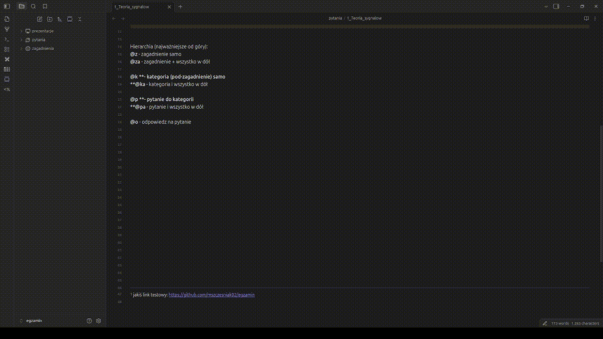
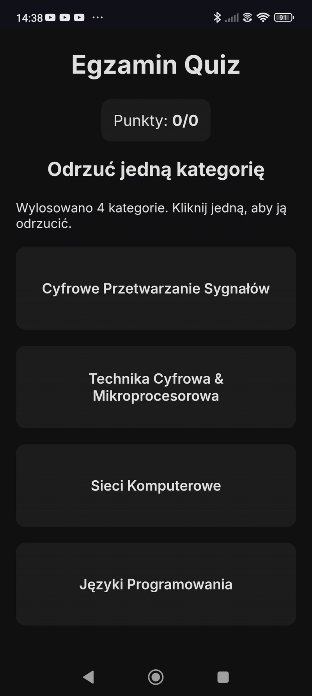

---
# Notatki i pytania do egzaminu ***EIT***
---
### tworzone w Obsidian, skróty do szybkiego wpisywania:
##### Hierarchia do pytań: (najważniejsze od góry):  ***( aby zatwierdzić -> wciśnij  ctrl+tab po wcześniejszym napisaniu np. @a, @z, @za itp)***

-**@z** - zagadnienie samo
-**@za** - zagadnienie + wszystko w dół
-**@k **- kategoria (pod-zagadnienie) samo
-**@ka** - kategoria i wszystko w dół
-**@p **- pytanie do kategorii
-**@pa** - pytanie i wszystko w dół
-**@o** - odpowiedz na pytanie

---

# Stronka do zgadywania pytań pod linkiem:

---
Mateusz Szczęśniak, Wojtek Minior

